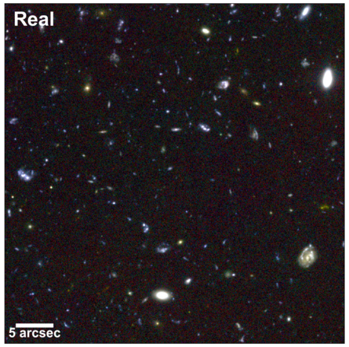
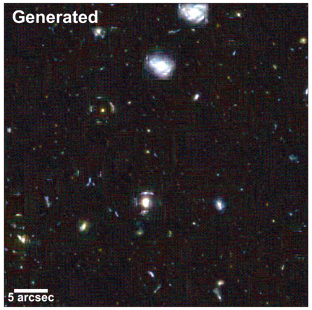

# Generative deep fields: arbitrarily sized, random synthetic astronomical images through deep learning

Generate mock galaxy surveys with a Spatial GAN (SGAN)-like architecture.

## Model description

An SGAN is used to generate mock galaxy surveys from data that is preprocessed as little as possible (preprocessing is only a 99.99th percentile clipping). Therefore real physics can be done on the outputs!

The outputs can also be tesselated together to create a very large survey (see Very Large XDF, below), limited in size only by the RAM of the generation machine.

## Examples

[Very Large XDF](http://star.herts.ac.uk/~jgeach/gdf.html)

By layering randomly sized crops (and interpolating them all to the same size) of the above large image we can get a result like this:


A comparison between the real and generated extreme deep fields:

 

## Training the model

Run `preprocess_fits.ipynb` to download and channel-wise clip the XDF FITS data at 99.99%.

If we want to train from scratch to 10,000 epochs we would run the following code:

```bash
python sgan.py -e 10001 -f $FITS_IMAGE_FILE
```

## Generating a set of imagery

To generate a set of 4 FITS images from the model `$KERAS_MODEL_FILE`, that are the same size as the XDF:

```bash
python run-sgan.py --model $KERAS_MODEL_FILE -z 232 -n 4 -f
```

These images are dumped into the default log directory.

## Generating a very large image that can't fit in memory

We may want to generate a very large FITS image that won't fit in memory (say [60,000 by 60,000 pixels](http://star.herts.ac.uk/~jgeach/gdf.html)).
To do this we can split the noise array, pass it through the GAN, and stitch the outputs back together.
This is what run-sgan-tessellate.py does:

```bash
python run-sgan-tesselate.py --model $KERAS_MODEL_FILE -z 1024 -f
```

The above code creates a 16384 by 16384 image (16 times z) using the model `$KERAS_MODEL_FILE`, and dumps the output into a fits file in the default log directory.
